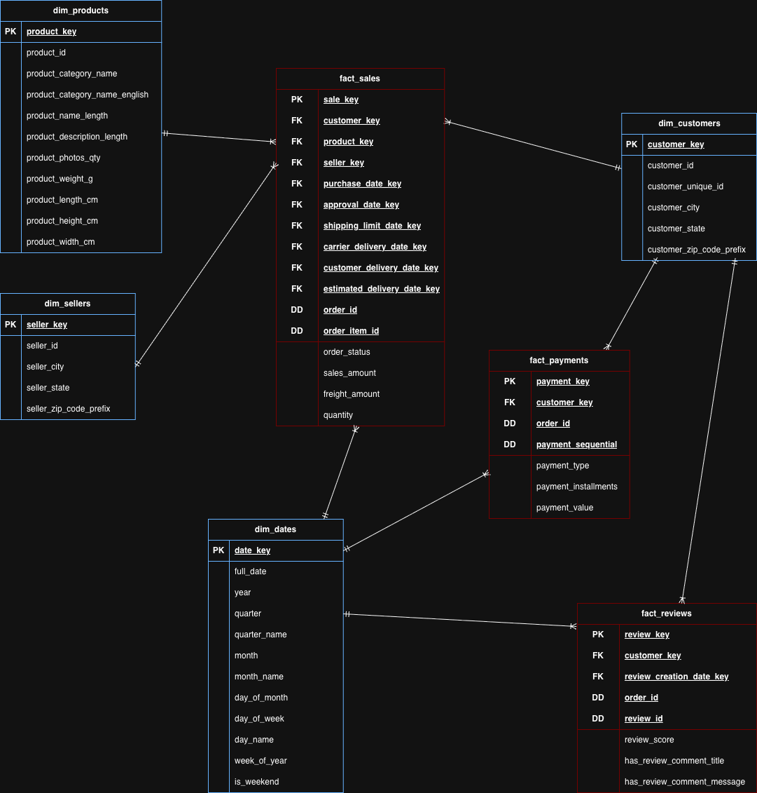

# Gold Layer

## Business Objectives

The Gold layer provides business-ready, analytics-ready datasets designed to support reporting, business intelligence, ad hoc analysis, and advanced analytical workloads. Unlike the Bronze and Silver layers, which focus on data ingestion and data transformation, the Gold layer organizes data into dimensional models that are easy to understand, efficient to query, and optimized for business reporting.

### Objectives

- Enable analysis of customer purchasing behavior.
- Monitor sales performance over time.
- Evaluate product performance across categories.
- Track order fulfillment and delivery performance.
- Analyze payment trends and customer payment behavior.
- Support customer segmentation and customer behavior analysis.
- Provide datasets optimized for dashboards, reporting, and analytical workloads.

## Target Audience

The Gold layer is designed to support a wide range of data consumers by providing business-ready datasets that are optimized for reporting, analytics, and decision-making.

### Business Intelligence (BI)

Business intelligence tools consume the Gold layer to build dashboards and reports that provide insights into business performance (e.g., Power BI, Tableau, Metabase).

### Business Analysts

Business analysts use the Gold layer to perform ad hoc SQL queries, monitor key performance indicators (KPIs), and identify business trends.

Typical activities include:

- Sales analysis
- Customer analysis
- Product performance analysis
- Operational reporting

### Data Scientists

Data scientists use the Gold layer to prepare analytical datasets for statistical modeling and machine learning.

Typical use cases include:

- Customer segmentation
- Customer behavior analysis
- Sales forecasting
- Product recommendation models

### Machine Learning Applications

Machine learning models consume the Gold layer as a clean and consistent source of business-ready data for predictive analytics and intelligent applications.

## Key Business Questions

The Gold layer enables stakeholders to answer key business questions related to sales performance, customer behavior, product performance, order fulfillment, and payment trends.

### Customer Analysis

- Who are the most valuable customers based on total revenue?
- How many unique customers make purchases each year?
- Which customers place the most orders?
- Which customers generate the highest revenue?
- Which customer segments have the highest satisfaction ratings?

### Product Analysis

- Which products generate the highest revenue?
- Which products sell the largest quantities?
- Which product categories perform best?
- Which products show declining sales over time?
- What is the average selling price of each product?

### Sales Analysis

- How are sales trending over time?
- What are the monthly and yearly sales totals?
- Which months and years generate the highest revenue?
- What is the average order value (AOV)?

### Order Analysis

- How many orders were delivered?
- How many orders were canceled?
- What is the average delivery time?
- Which order statuses occur most frequently?

### Payment Analysis

- Which payment methods are most commonly used?
- What is the average payment amount?
- How many installments do customers typically choose?

## Key Performance Indicators (KPIs)

The Gold layer supports a comprehensive set of key performance indicators (KPIs) that enable stakeholders to monitor business performance across sales, customers, products, orders, payments, and customer satisfaction.

### Sales KPIs

- Total Revenue
- Total Orders
- Average Order Value (AOV)
- Revenue Growth Rate
- Monthly Revenue
- Yearly Revenue

### Customer KPIs

- Total Customers
- New Customers
- Returning Customers
- Customer Lifetime Value (CLV)
- Average Orders per Customer

### Product KPIs

- Total Products Sold
- Top-Selling Products
- Top-Selling Categories
- Average Selling Price

### Order KPIs

- Delivered Orders
- Canceled Orders
- Order Fulfillment Rate
- Average Delivery Time

### Payment KPIs

- Total Payment Value
- Average Payment Value
- Average Number of Installments
- Payment Method Distribution

### Customer Satisfaction KPIs

- Average Review Score
- Review Score Distribution
- Percentage of Five-Star Reviews
- Percentage of One-Star Reviews

## Dimensional Modeling Approach

The Gold layer follows a **Star Schema** design to provide a simple, intuitive, and high-performance model for analytical queries. The schema consists of centralized fact tables that store measurable business events and surrounding dimension tables that provide descriptive business context.

This design minimizes complex joins, improves query performance, and provides a consistent structure for business intelligence, reporting, and analytical workloads.

### Gold Layer Tables

The Gold layer is logically organized into fact and dimension tables following the star schema model. Although these objects are physically implemented as SQL views, they are documented as tables because they represent the logical dimensional model.

#### Fact Tables

| Table | Description | Grain | Source |
|-------|-------------|-------|--------|
| `fact_sales` | Sales transactions | One row → single product purchased within an order | `silver.olist_order_items`, `silver.olist_orders` |
| `fact_payments` | Customer payment transactions | One row → single payment transaction for an order | `silver.olist_order_payments`, `silver.olist_orders` |
| `fact_reviews` | Customer review records | One row → single customer review for an order | `silver.olist_order_reviews`, `silver.olist_orders` |

#### Dimension Tables

| Table | Description | Grain | Source |
|-------|-------------|-------|--------|
| `dim_customers` | Customer information | One row → unique customer | `silver.olist_customers` |
| `dim_products` | Product information | One row → unique product | `silver.olist_products`, `silver.olist_product_category_translations` |
| `dim_sellers` | Seller information | One row → unique seller | `silver.olist_sellers` |
| `dim_dates` | Calendar date information | One row → single calendar date | Generated from business date columns in the Silver layer |

### Star Schema



## Gold Layer Business Rules

The Gold layer applies the following business rules to ensure a consistent, reliable, and analytics-ready dimensional model.

### Dimensional Modeling

- All dimension tables use integer surrogate keys as their primary keys.
- Source business keys are preserved in dimension tables for traceability.
- Fact tables reference dimension tables using surrogate keys.
- Missing dimension lookups are represented by `NULL` values.

### Date Modeling

- Calendar attributes (such as year, quarter, month, and weekday) are generated from the centralized `dim_dates` table to ensure consistent time-based analysis.
- Fact tables reference `dim_dates` using role-playing date keys for each business event (e.g., purchase date, approval date, delivery date).

### Measures

- Additive measures (such as `sales_amount`, `freight_amount`, and `payment_value`) may be aggregated using `SUM()`.
- Non-additive measures (such as `review_score`) should be aggregated using `AVG()` and must not be summed.
- Orders are counted using `COUNT(DISTINCT order_id)` to avoid duplicate counts.

### Naming Conventions

- Gold objects and columns follow the lowercase `snake_case` naming convention.
- Dimension views use the `dim_` prefix, and fact views use the `fact_` prefix.
- Surrogate keys use the `_key` suffix, while source business identifiers use the `_id` suffix.

## Gold Data Dictionary

### `gold.dim_customers`

| Column | Data Type | Description | Business Definition | Source Column | Transformation Logic |
|----------|-----------|-------------|---------------------|---------------|----------------------|
| `customer_key` | INTEGER | Surrogate primary key. | Unique warehouse identifier for a customer. | Generated | Generated using `ROW_NUMBER()`. |
| `customer_id` | VARCHAR(32) | Source customer identifier. | Customer record associated with an order. | `silver.olist_customers.customer_id` | Copied from Silver. |
| `customer_unique_id` | VARCHAR(32) | Customer business identifier. | Represents the same customer across multiple orders. | `silver.olist_customers.customer_unique_id` | Copied from Silver. |
| `customer_city` | VARCHAR(100) | Customer city. | City where the customer is located. | `silver.olist_customers.customer_city` | Copied from Silver. |
| `customer_state` | VARCHAR(2) | Customer state. | Brazilian state abbreviation. | `silver.olist_customers.customer_state` | Copied from Silver. |
| `customer_zip_code_prefix` | VARCHAR(5) | ZIP code prefix. | Customer geographic ZIP prefix. | `silver.olist_customers.customer_zip_code_prefix` | Copied from Silver. |

### `gold.dim_products`

| Column | Data Type | Description | Business Definition | Source Column | Transformation Logic |
|----------|-----------|-------------|---------------------|---------------|----------------------|
| `product_key` | INTEGER | Surrogate primary key. | Unique warehouse identifier for a product. | Generated | Generated using `ROW_NUMBER()`. |
| `product_id` | VARCHAR(32) | Product identifier. | Unique product sold by Olist. | `silver.olist_products.product_id` | Copied from Silver. |
| `product_category_name` | VARCHAR(100) | Portuguese category. | Original product category. | `silver.olist_products.product_category_name` | Copied from Silver. |
| `product_category_name_english` | VARCHAR(100) | English category. | English product category used for reporting. | `silver.olist_product_category_translations.product_category_name_english` | Joined using category name. |
| `product_name_length` | INTEGER | Product name length. | Number of characters in the product name. | `silver.olist_products.product_name_length` | Copied from Silver. |
| `product_description_length` | INTEGER | Product description length. | Number of characters in the description. | `silver.olist_products.product_description_length` | Copied from Silver. |
| `product_photos_qty` | INTEGER | Number of photos. | Number of published product photos. | `silver.olist_products.product_photos_qty` | Copied from Silver. |
| `product_weight_g` | NUMERIC(10,2) | Product weight. | Product weight in grams. | `silver.olist_products.product_weight_g` | Copied from Silver. |
| `product_length_cm` | NUMERIC(10,2) | Product length. | Product length in centimeters. | `silver.olist_products.product_length_cm` | Copied from Silver. |
| `product_height_cm` | NUMERIC(10,2) | Product height. | Product height in centimeters. | `silver.olist_products.product_height_cm` | Copied from Silver. |
| `product_width_cm` | NUMERIC(10,2) | Product width. | Product width in centimeters. | `silver.olist_products.product_width_cm` | Copied from Silver. |

### `gold.dim_sellers`

| Column | Data Type | Description | Business Definition | Source Column | Transformation Logic |
|----------|-----------|-------------|---------------------|---------------|----------------------|
| `seller_key` | INTEGER | Surrogate primary key. | Unique warehouse identifier for a seller. | Generated | Generated using `ROW_NUMBER()`. |
| `seller_id` | VARCHAR(32) | Seller identifier. | Unique seller in Olist. | `silver.olist_sellers.seller_id` | Copied from Silver. |
| `seller_city` | VARCHAR(100) | Seller city. | Seller location city. | `silver.olist_sellers.seller_city` | Copied from Silver. |
| `seller_state` | VARCHAR(2) | Seller state. | Seller state abbreviation. | `silver.olist_sellers.seller_state` | Copied from Silver. |
| `seller_zip_code_prefix` | VARCHAR(5) | ZIP code prefix. | Seller geographic ZIP prefix. | `silver.olist_sellers.seller_zip_code_prefix` | Copied from Silver. |

### `gold.dim_dates`

| Column | Data Type | Description | Business Definition | Source Column | Transformation Logic |
|----------|-----------|-------------|---------------------|---------------|----------------------|
| `date_key` | INTEGER | Surrogate date key. | Integer representation of a calendar date (YYYYMMDD). | Generated using `ROW_NUMBER()`. |
| `full_date` | DATE | Calendar date. | Actual calendar date. | Generated | Generated while populating the date dimension. |
| `year` | SMALLINT | Calendar year. | Year component. | Generated | Extracted from `full_date`. |
| `quarter` | SMALLINT | Quarter number. | Quarter of the year. | Generated | Extracted from `full_date`. |
| `quarter_name` | VARCHAR(2) | Quarter label. | Business quarter (Q1-Q4). | Generated | Derived from `quarter`. |
| `month` | SMALLINT | Month number. | Month of the year. | Generated | Extracted from `full_date`. |
| `month_name` | VARCHAR(20) | Month name. | Full month name. | Generated | Derived from `full_date`. |
| `day_of_month` | SMALLINT | Day number. | Day within the month. | Generated | Extracted from `full_date`. |
| `day_of_week` | SMALLINT | Weekday number. | Day of week. | Generated | Extracted from `full_date`. |
| `day_name` | VARCHAR(20) | Weekday name. | Business weekday name. | Generated | Derived from `full_date`. |
| `week_of_year` | SMALLINT | Week number. | ISO week number. | Generated | Derived from `full_date`. |
| `is_weekend` | BOOLEAN | Weekend flag. | Indicates whether the date falls on Saturday or Sunday. | Generated | Derived from `day_of_week`. |

### `gold.fact_sales`

| Column | Data Type | Description | Business Definition | Source Column | Transformation Logic |
|----------|-----------|-------------|---------------------|---------------|----------------------|
| `sale_key` | INTEGER | Surrogate primary key. | Unique warehouse identifier for a sales record. | Generated | Generated using `ROW_NUMBER()`. |
| `customer_key` | INTEGER | Customer foreign key. | Customer who placed the order. | `gold.dim_customers.customer_key` | Lookup using `customer_id`. |
| `product_key` | INTEGER | Product foreign key. | Product purchased. | `gold.dim_products.product_key` | Lookup using `product_id`. |
| `seller_key` | INTEGER | Seller foreign key. | Seller fulfilling the order. | `gold.dim_sellers.seller_key` | Lookup using `seller_id`. |
| `purchase_date_key` | INTEGER | Purchase date key. | Date the order was placed. | `silver.olist_orders.order_purchase_timestamp` | Lookup in `dim_dates`. |
| `approval_date_key` | INTEGER | Approval date key. | Date payment was approved. | `silver.olist_orders.order_approved_at` | Lookup in `dim_dates`. |
| `shipping_limit_date_key` | INTEGER | Shipping deadline key. | Seller shipping deadline. | `silver.olist_order_items.shipping_limit_date` | Lookup in `dim_dates`. |
| `carrier_delivery_date_key` | INTEGER | Carrier delivery date key. | Date shipped to the carrier. | `silver.olist_orders.order_delivered_carrier_date` | Lookup in `dim_dates`. |
| `customer_delivery_date_key` | INTEGER | Customer delivery date key. | Date delivered to the customer. | `silver.olist_orders.order_delivered_customer_date` | Lookup in `dim_dates`. |
| `estimated_delivery_date_key` | INTEGER | Estimated delivery date key. | Estimated delivery date. | `silver.olist_orders.order_estimated_delivery_date` | Lookup in `dim_dates`. |
| `order_id` | VARCHAR(32) | Order identifier. | Business identifier for the order. | `silver.olist_orders.order_id` | Copied from Silver. |
| `order_item_id` | INTEGER | Item sequence. | Identifies the item within an order. | `silver.olist_order_items.order_item_id` | Copied from Silver. |
| `sales_amount` | NUMERIC(10,2) | Sales amount. | Revenue generated by the product excluding freight. | `silver.olist_order_items.price` | Copied from Silver. |
| `freight_amount` | NUMERIC(10,2) | Freight amount. | Shipping cost charged for the order item. | `silver.olist_order_items.freight_value` | Copied from Silver. |
| `quantity` | INTEGER | Quantity sold. | Number of units sold. | Generated | Assigned value `1` for every order item. |

### `gold.fact_payments`

| Column | Data Type | Description | Business Definition | Source Column | Transformation Logic |
|----------|-----------|-------------|---------------------|---------------|----------------------|
| `payment_key` | INTEGER | Surrogate primary key. | Unique warehouse identifier for a payment. | Generated | Generated using `ROW_NUMBER()`. |
| `customer_key` | INTEGER | Customer foreign key. | Customer who made the payment. | `gold.dim_customers.customer_key` | Lookup using order. |
| `order_id` | VARCHAR(32) | Order identifier. | Order associated with the payment. | `silver.olist_order_payments.order_id` | Copied from Silver. |
| `payment_sequential` | INTEGER | Payment sequence. | Sequence of the payment within the order. | `silver.olist_order_payments.payment_sequential` | Copied from Silver. |
| `payment_type` | VARCHAR(30) | Payment method. | Method used by the customer to pay. | `silver.olist_order_payments.payment_type` | Copied from Silver. |
| `payment_installments` | INTEGER | Installment count. | Number of installments used. | `silver.olist_order_payments.payment_installments` | Copied from Silver. |
| `payment_value` | NUMERIC(10,2) | Payment amount. | Amount paid in this payment transaction. | `silver.olist_order_payments.payment_value` | Copied from Silver. |

### `gold.fact_reviews`

| Column | Data Type | Description | Business Definition | Source Column | Transformation Logic |
|----------|-----------|-------------|---------------------|---------------|----------------------|
| `review_key` | INTEGER | Surrogate primary key. | Unique warehouse identifier for a review. | Generated | Generated using `ROW_NUMBER()`. |
| `customer_key` | INTEGER | Customer foreign key. | Customer who submitted the review. | `gold.dim_customers.customer_key` | Lookup using order. |
| `review_creation_date_key` | INTEGER | Review creation date key. | Date the review was created. | `silver.olist_order_reviews.review_creation_date` | Lookup in `dim_dates`. |
| `order_id` | VARCHAR(32) | Order identifier. | Order associated with the review. | `silver.olist_order_reviews.order_id` | Copied from Silver. |
| `review_id` | VARCHAR(32) | Review identifier. | Business identifier of the review. | `silver.olist_order_reviews.review_id` | Copied from Silver. |
| `review_score` | SMALLINT | Review score. | Customer satisfaction rating from 1 to 5. | `silver.olist_order_reviews.review_score` | Copied from Silver. |
| `has_review_comment_title` | BOOLEAN | Review title indicator. | Indicates whether a review title exists. | `silver.olist_order_reviews.review_comment_title` | Derived using `CASE WHEN review_comment_title IS NULL THEN FALSE ELSE TRUE END`. |
| `has_review_comment_message` | BOOLEAN | Review message indicator. | Indicates whether a review message exists. | `silver.olist_order_reviews.review_comment_message` | Derived using `CASE WHEN review_comment_message IS NULL THEN FALSE ELSE TRUE END`. |

## Gold Validation Strategy

The Gold layer stores business-ready dimension and fact views that support reporting, analytics, and business decision-making.

Unlike the Bronze and Silver layers, where validation focuses on data quality and cleansing, Gold layer validation focuses on ensuring the analytical correctness, consistency, and completeness of the dimensional model.

The Gold layer validation process consists of the following categories:

### 1. Row Count Validation

- **Purpose:** Verify that each Gold object contains the expected number of records after creation.
- **Validation Rule:** Verify that each Gold object contains the expected number of records based on its corresponding Silver source data.

### 2. Fact-to-Dimension Relationship Validation

- **Purpose:** Ensure that every foreign key stored in a fact view references a valid dimension record.
- **Validation Rule:** Verify that every surrogate key stored as a foreign key in a fact view exists in its corresponding dimension view.

### 3. Missing Dimension Lookup Validation

- **Purpose:** Identify business records that could not be matched to their corresponding dimensions during view creation.
- **Validation Rule:** Verify that no fact record contains unexpected `NULL` foreign keys, excluding nullable date keys.

### 4. Measure Validation

- **Purpose:** Ensure that analytical measures are correctly exposed from the Silver layer.
- **Validation Rule:** Validate that all business measures are accurate, satisfy business rules, and reconcile with their corresponding values in the Silver layer.

### 5. KPI Validation

- **Purpose:** Ensure that commonly used business metrics produce expected results.
- **Validation Rule:** Verify that each KPI produces the same result whether calculated from the Gold layer or directly from the Silver layer.

## Performance Strategy

The Gold layer is designed to support fast and efficient analytical queries by applying dimensional modeling best practices and minimizing query complexity. Its design prioritizes business intelligence, reporting, and analytical workloads over transactional processing.

### Star Schema Design

- Use a star schema to minimize joins and simplify analytical queries.
- Store descriptive attributes in dimension tables and numerical measures in fact tables.

### Surrogate Keys

- Use integer surrogate keys for all dimension tables.
- Reference dimension tables from fact tables using surrogate keys to improve join performance.

### Denormalization

- Denormalize descriptive business attributes into dimension tables where appropriate.
- Avoid unnecessary normalization in the Gold layer to reduce query complexity and improve query performance.

### Materialized Objects

- The Gold layer is implemented using SQL views rather than physical tables.
- Views provide a consistent business-ready semantic layer while avoiding data duplication.
- Because the Olist dataset is relatively small, SQL views provide sufficient performance while keeping the implementation simple.
- For larger production environments, materialized views or physical tables may be considered to improve query performance.

### Query Optimization

- Design fact tables at the lowest business grain to support flexible aggregations.
- Avoid storing derived measures that can be calculated during reporting to reduce data redundancy and maintain consistency.
- Minimize unnecessary joins by exposing business-ready dimensions and facts.

### Expected Workload

The Gold layer is optimized for:

- Business intelligence dashboards
- Business reporting
- Ad hoc SQL analysis
- KPI calculation
- Data science and machine learning

## SQL Script Organization

Gold layer SQL scripts are organized into multiple files based on responsibility. This approach improves readability, maintainability, and scalability while clearly separating dimension creation, fact creation, and validation logic.

Folder structure:

```text
sql/
└── 04_gold/
    ├── 01_create_dimensions.sql
    ├── 02_create_facts.sql
    └── 03_validate_gold.sql
```

| Script | Purpose |
|---------|---------|
| `01_create_dimensions.sql` | Creates the Gold dimension views (`dim_customers`, `dim_products`, `dim_sellers`, and `dim_dates`) from the Silver layer. |
| `02_create_facts.sql` | Creates the Gold fact views (`fact_sales`, `fact_payments`, and `fact_reviews`) by combining Silver data with the Gold dimensions to produce business-ready analytical datasets. |
| `03_validate_gold.sql` | Contains post-load validation queries to verify row counts, fact-to-dimension relationships, missing dimension lookups, measure accuracy, and KPI reconciliation. |

## Summary

The Gold layer represents the presentation and analytics layer of the data warehouse, providing business-ready datasets optimized for reporting, business intelligence, and analytical workloads. It follows a star schema design that organizes data into fact and dimension models, enabling simple, consistent, and high-performance analytical queries.

The Gold layer is implemented using SQL views built on top of the cleansed and standardized Silver layer. These views expose a semantic model that simplifies data access while avoiding unnecessary data duplication. The dimensional model preserves business context through dimension views and captures measurable business events through fact views.

To ensure data quality and analytical reliability, the Gold layer incorporates validation procedures that verify row counts, dimension lookups, measure accuracy, and KPI consistency. Combined with dimensional modeling best practices, this design provides a scalable foundation for dashboards, ad hoc analysis, business reporting, and future advanced analytics.